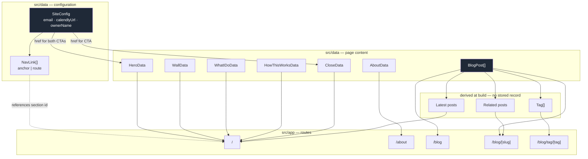

# Architecture — daviesbuildsdev.github.io

Dale Davies' sole-trader site. Phases 2–5 of the product spec, standalone.

Everything below is *derived* from the spine in section 1. If a component, route or
package cannot be traced back to it, it does not exist yet — either the map is missing
something or the thing is imaginary.

Reference implementation is `mattwilson.tech` (Next 15 static export, Tailwind 4,
typed content modules). Patterns are lifted deliberately, not by accident.

---

## 1. The spine — content model and the routes over it

This is a marketing site. The spine is therefore the **content model and the routes
over it**, not an entity/relationship model. There is no database, no user, no session
and no write path. Every piece of content is a typed TypeScript module compiled into a
static build.

### 1.1 Elements

| Element | Purpose | Properties that carry meaning |
|---|---|---|
| `SiteConfig` | Single source for identity and conversion endpoints | `ownerName`, `email`, `calendlyUrl`, `siteUrl`, `socials[]` |
| `NavLink` | One item in the primary navigation | `label`, `id`, `kind` (`anchor` \| `route`), `anchor?`, `route` |
| `HeroData` | The masthead section | `eyebrow`, `name`, `statement`, `primaryCta` |
| `WhatIDoData` | The offering section | `heading`, `items[] { title, body }` |
| `HowThisWorksData` | The engagement/process section | `heading`, `points[] { label, body }` |
| `WallData` | The recognition section — the reader's problem | `heading`, `body`, `points[]` |
| `CloseData` | The closing CTA section | `heading`, `body`, `covers[]`, `cta` |
| `AboutData` | The `/about` route body | `heading`, `paragraphs[]` |
| `BlogPost` | One article | `slug`, `title`, `date`, `excerpt`, `tags[]`, `readingTime`, `content` |
| `Tag` | A blog taxonomy term | **Derived** — has no stored record |

### 1.2 Relationships and ownership

- **`BlogPost` owns its tags.** `Tag` is computed at build time by reducing over
  `blogPosts`. There is no tag registry, no tag description, and no tag that exists
  without a post. A tag page for a tag with zero posts is a 404, not an empty page.
- **`NavLink` references, it does not own.** An `anchor` link points at a DOM `id`
  rendered by a home-page section component. The section owns the id; the nav borrows
  it. A mismatch is a silent dead link — see the seam in section 4.1.
- **`SiteConfig` owns every conversion endpoint.** The hero CTA, the close CTA, the
  nav booking button and the footer all *reference* `calendlyUrl` and `email`. None of
  them carries its own copy of the value.

  🔴 This is a deliberate divergence from `mattwilson.tech`, where `heroData.primaryCta.href`
  and `closeData.cta.href` each hold their own string. Two copies of one fact will
  disagree. Dale changing his Calendly link must be a one-line edit in one file.

- **`BlogPost` has no relationship to anything else.** Home's "latest posts" strip and
  the related-posts block are both *projections* over the same array, computed at build
  time. Neither stores a reference.

### 1.3 States and lifecycles

Only one element has a lifecycle, and at launch it has one state.

- `BlogPost`: **published**. There is no draft state, no scheduled state and no
  unpublish. A post is published when it is present in the array on `main`.
  Removing it is a commit.

  ⚠️ **Known unknown:** whether Dale wants a draft state. Not authorised to build one.
  Recorded, not resolved.

### 1.4 Boundaries

Four clusters, and the rule that crosses between them is absolute.

| Directory | Holds | May not contain |
|---|---|---|
| `src/data` | All content, typed. The *why* lives here in comments | JSX, imports from `src/components` |
| `src/components` | All presentation | Any string a visitor reads |
| `src/app` | Routing, metadata, layout | Business content |
| `src/lib` | Pure helpers (dates, reading time, headings) | React, content |

🔴 **The rule: any string a visitor reads lives in `src/data`.** This is what makes
phase 2 a content edit rather than a rewrite, and it is the single most important
structural decision in this repo. It is also the property that lets Dale change his
own site without touching a component.

### 1.5 Unknowns — first class, not to be filled in

| # | Unknown | Blocks | Status |
|---|---|---|---|
| U1 | Dale's GitHub username availability (`daviesbuildsdev` intended, account not yet created) | Phase 3 transfer only | Open. Does not block phase 1 |
| U2 | Dale's Calendly URL | Correct CTA target | Open. Closed for phase 1 by a `TODO` placeholder in `SiteConfig` |
| U3 | Dale's business email address | `mailto:` target | Open. Same placeholder mechanism |
| U4 | Trading name — is the site "Dale Davies" or a brand? | Masthead, metadata, OG title | Open. Phase 2. Placeholder in phase 1 |
| U5 | Brand palette and typography | Design tokens | Open. Phase 2 by design — phase 1 ships a neutral token set |
| U6 | ICP, offer wording, pricing posture | All section copy | Open. Phase 2. Dale's to write, not ours to generate |
| U7 | Draft/unpublished post handling | `BlogPost` lifecycle | Open. Not authorised |
| U8 | Whether Dale wants light/dark theming | Token structure | Open. Phase 1 ships one theme |

**None of U1–U8 sits inside the phase 1 authorising set.** U2, U3 and U4 are neutralised
for phase 1 by centralising them as explicitly-marked placeholders — the phase 1
requirement is that they are *centralised*, never that they are *correct*.

### 1.6 The map

---

## 2. Actors and surfaces — derived from the map

Three actors touch this system. Grouping them by which part of the spine they touch
produces **one** application surface, not three.

> **Public static site** — Prospects (from LinkedIn, Instagram, or a shared post) touch
> `HeroData`, `WallData`, `WhatIDoData`, `HowThisWorksData`, `CloseData`, `AboutData`
> and `BlogPost`. All read-only. All from a phone as often as a laptop. Their only
> writes leave the system entirely — Calendly and the mail client.

> **The repository** — Dale, as author, touches `src/data/*.ts` directly. This is his
> authoring surface. There is deliberately **no CMS and no admin UI**, because a second
> write path would need a server, and the whole point of the static export is that
> there isn't one.

> **CI** — GitHub Actions touches the repo, not the content model. It is a gate, not
> a surface.

No fourth surface can be derived from the map. There is no logged-in view, no client
portal and no dashboard, because no element in section 1.1 has an owner or a
permission.

### 2.1 Journeys, named because evaluation runs against them

| J | Journey | Entry | Exit |
|---|---|---|---|
| J1 | Cold prospect from social | `/` | Calendly, or bounce |
| J2 | Prospect reading an article | `/blog/[slug]` | Close CTA → Calendly |
| J3 | Prospect checking who Dale is | `/about` | Calendly or mail |
| J4 | Dale publishing an article | `src/data/blog.ts` | Green CI, live post |

---

## 3. Stack — choice, reason, falsifier

The third column is what makes this an audit trail rather than a list of preferences.
Bias throughout is toward **what Matt already runs**, because the phase 1 session is
sixty minutes with a human watching and there is no room to debug an unfamiliar tool.

| Choice | Reason | What would falsify it |
|---|---|---|
| **Next 15, App Router** | Identical to `mattwilson.tech`. Patterns are transferable at speed under live-demo pressure | Dale needs a runtime server — form POST, auth, personalised content |
| **`output: "export"`** | No server, no hosting bill, GitHub Pages serves it directly. Removes an entire class of failure from a beginner's first repo | Any requirement that cannot be resolved at build time |
| **React 19 + TypeScript 5, `strict`** | The type checker *is* the check layer, given no test suite. Malformed content fails the build | Type errors start being suppressed rather than fixed |
| **Tailwind 4 via `@tailwindcss/postcss`** | Same as the reference site. Design tokens as CSS variables lets phase 2 rebrand without touching markup | Dale's brand needs a design system that fights utility classes |
| **pnpm, Node 22** | Same as the reference site; CI cache and lockfile behaviour already proven in that repo's workflow | Dale's machine cannot run corepack — then npm, and the lockfile changes |
| **Content as typed TS modules** | Matt's explicit call, overruling a `.md` alternative. Metadata and body live together; the type checker validates shape | Dale breaks the build twice on template-literal escaping. Then revisit |
| **GitHub Actions → GitHub Pages** | The teaching objective. Dale watches a push become a check become a deploy | Nothing realistic at this scale |
| **No test framework** | Matt's explicit call. A static marketing site has near-zero branching logic; maintenance cost exceeds the value | A regression ships that typecheck, lint and build could not have caught |
| **No animation library in phase 1** | `framer-motion` is a design decision, and phase 1 makes none | Phase 2 wants motion. Then it is added deliberately |

### 3.1 Deliberately absent

`next/image` optimisation (incompatible with static export — `images.unoptimized: true`),
route handlers, middleware, server actions, any database, any auth, any analytics,
any form backend.

---

## 4. Seams and contracts

Solo, the seams are not between people. They are **between sprints and between agents**,
and the failure mode is documented: a change lands on one consumer and silently misses
the others, while every automated check stays green.

Each contract below is stated **once**, and its consumers are **named**, so a change
has a checklist instead of relying on memory.

### 4.1 The nav-anchor contract

An `anchor` `NavLink` carries an `anchor` value of `#<id>`. Some home-page section
must render an element with exactly that `id`. Nothing in the type system enforces
this; a mismatch renders a link that scrolls nowhere.

**Consumers of a section `id`:** the section component that renders it, `nav.tsx`
(link target), the scroll-spy active-state logic, and any in-page CTA that jumps to it.

🔴 **Anchors and routes must not share a code path.** An in-page `id` can never equal a
pathname, so an active-state check that tries to serve both will always be wrong for
one of them. `kind` exists precisely to keep them apart.

### 4.2 The `SiteConfig` contract

`email` and `calendlyUrl` are declared once in `src/data/site.ts`.

**Consumers:** hero CTA, close CTA, nav booking button, footer contact, blog-post
closing CTA. Five call sites, one value. A grep for a literal `calendly.com` or a
literal `mailto:` anywhere outside `site.ts` is a defect.

### 4.3 The `BlogPost` contract

Field names and shapes are fixed by the interface in section 1.1. `date` is
`YYYY-MM-DD`. `slug` is kebab-case, unique, and is the URL segment.

**Consumers:** `/blog` index, `blog-card`, `/blog/[slug]`, `/blog/tag/[tag]`, the home
page latest-posts strip, related posts, and `generateStaticParams` for both dynamic
routes.

⚠️ Adding a required field to `BlogPost` is a breaking change across seven consumers.
The type checker catches it — which is the whole argument for typed content modules.

### 4.4 The route contract

`trailingSlash: true`. **Every internal href ends in `/`.** A href without one causes a
redirect on Pages and a broken relative asset path in some cases.

**Consumers:** nav, footer, blog cards, related posts, breadcrumbs, any CTA pointing
at an internal route.

### 4.5 Platform boundaries

Valid in `next dev`, **invalid** in `output: "export"`:

- Route handlers (`app/api/**`), middleware, server actions
- `next/image` optimisation, `next/font` remote loading at request time
- A dynamic segment without `generateStaticParams`
- Anything reading request headers or cookies

🔴 A build that succeeds locally with `pnpm dev` and fails in CI is almost always one
of these. That is a teaching moment, not a surprise.

### 4.6 The empty-collection boundary

At launch `blogPosts` is `[]` or near it. Every consumer in 4.3 must render correctly
against an empty array — the index, the latest-posts strip, and the two dynamic routes,
which must generate zero paths without failing the build.

⚠️ This is the most likely phase 1 defect and it is invisible on a site that has posts.

---

## 5. Local environment

| | |
|---|---|
| Runtime | Node 22, pnpm |
| Dev | `pnpm dev` → `http://localhost:3000` |
| Check | `pnpm typecheck && pnpm lint && pnpm build` — identical to CI |
| Containerised | Nothing |
| External services simulated | Nothing. Calendly is an outbound link; `mailto:` is the operating system |

There is no service to mock because there is no service. This is a property of the
static-export decision, and it is why a beginner can run the whole system on a laptop
with two commands.
